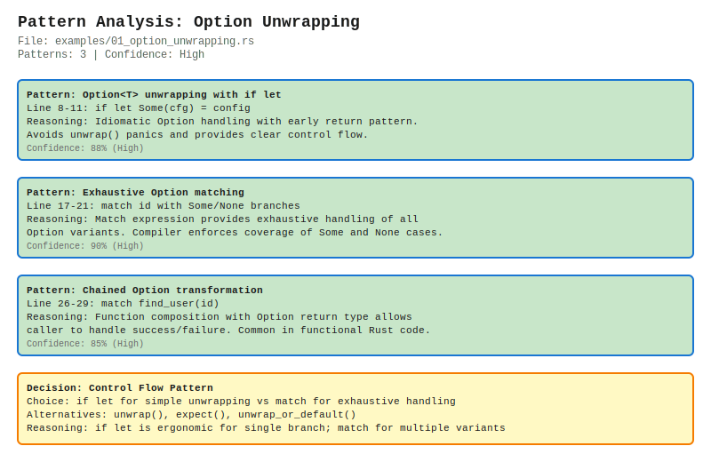

# rust-pattern-viz

> Visualize AI code generation decision trees directly from Rust source code

## What is this?

`rust-pattern-viz` is a Rust-native CLI tool and library that makes AI copilot behavior transparent and reviewable. It parses Rust source files containing embedded AI suggestion metadata, extracts pattern matching logic, and generates interactive SVG/HTML visualizations showing alternative imports considered, per-line confidence scores, and the complete reasoning directed acyclic graph (DAG). Designed for code reviews, PR comments, and understanding how AI assistants make decisions.

## Features

- **Multi-format Output**: Generate SVG diagrams, interactive HTML, or JSON exports
- **CLI + Library**: Use as a standalone tool or integrate into your Rust projects
- **LSP Integration**: Real-time hover tooltips in VS Code showing AI decision metadata
- **Web Interface**: Browser-based visualizer with live editing and preview
- **WASM Support**: Run visualizations client-side with zero backend dependencies
- **Pattern Analysis**: Automatic extraction of `match`, `if let`, and enum pattern logic
- **Shareable Links**: Deploy visualizations to a web server for team collaboration
- **CI/CD Ready**: GitHub Actions workflows for automated diagram generation

## Quick Start

### Installation

```bash
# Install from crates.io
cargo install rust-pattern-viz

# Or build from source
git clone https://github.com/yourusername/rust-pattern-viz.git
cd rust-pattern-viz
cargo build --release
```

### Basic Usage

```bash
# Analyze a Rust file and generate SVG
rust-pattern-viz analyze src/main.rs --output diagram.svg

# Launch interactive web server
rust-pattern-viz serve --port 8080

# Export to JSON for custom processing
rust-pattern-viz analyze examples/nested_match.rs --format json
```

### VS Code Extension

```bash
cd vscode-extension
npm install
npm run compile
# Press F5 in VS Code to launch extension development host
```

Hover over pattern match expressions to see AI confidence scores and alternative suggestions inline.

## Usage Examples

### Visualizing Option Unwrapping

```rust
// examples/01_option_unwrapping.rs
match some_value {
    Some(x) => println!("Got: {}", x),
    None => println!("Nothing here"),
}
```

Run `rust-pattern-viz analyze examples/01_option_unwrapping.rs` to generate:



### Result Error Handling

```rust
// examples/02_result_error_handling.rs
match operation() {
    Ok(data) => process(data),
    Err(e) => log_error(e),
}
```

Outputs a diagram showing branching logic, confidence scores, and alternative error handling patterns the AI considered.

### Web Demo

Launch the interactive demo:

```bash
cd web-demo
npm install
npm run dev
```

Open `http://localhost:5173` to paste Rust code and see live visualizations.

## Tech Stack

- **Core**: Rust 1.70+ with `syn` for parsing, `quote` for code generation
- **Rendering**: SVG generation via custom renderer, HTML templates with embedded JS
- **Web**: Actix-web for HTTP server, Warp for LSP server
- **WASM**: `wasm-bindgen` and `wasm-pack` for browser compatibility
- **Frontend**: TypeScript + Vite + React (web demo)
- **CI/CD**: GitHub Actions for automated testing and demo deployment

## Project Structure

```
rust-pattern-viz/
├── src/
│   ├── analyzer.rs      # AST parsing and pattern extraction
│   ├── models.rs        # Data structures for decision trees
│   ├── svg_renderer.rs  # SVG diagram generation
│   ├── visualizer.rs    # High-level visualization API
│   ├── lsp_server.rs    # Language Server Protocol integration
│   └── web_server.rs    # HTTP endpoints for browser UI
├── examples/            # Sample Rust files with AI metadata
├── vscode-extension/    # VS Code LSP client
├── web-demo/           # React-based interactive playground
├── wasm/               # Browser-compatible WASM module
└── docs/               # Architecture diagrams and guides
```

## Contributing

See [CONTRIBUTING.md](CONTRIBUTING.md) for development setup, testing guidelines, and PR submission process. Check [ARCHITECTURE.md](ARCHITECTURE.md) for system design details.

## License

MIT License - see [LICENSE](LICENSE) for full text.

---

**Built with Rust** 🦀 | [Report Issues](https://github.com/yourusername/rust-pattern-viz/issues) | [View Examples](./examples)