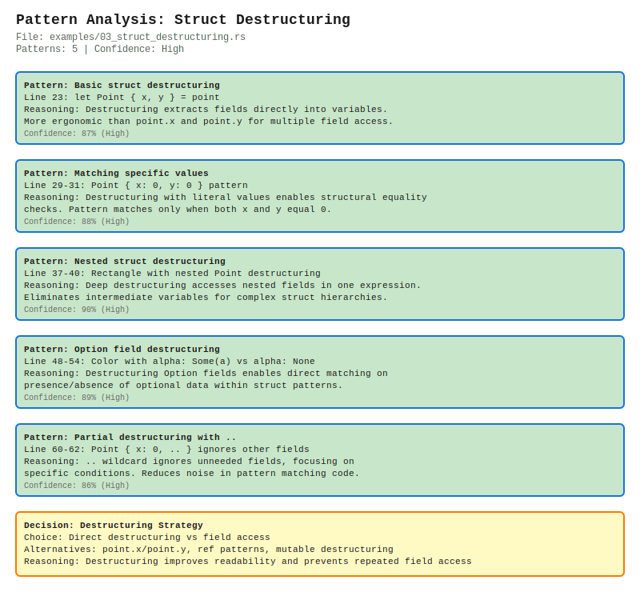
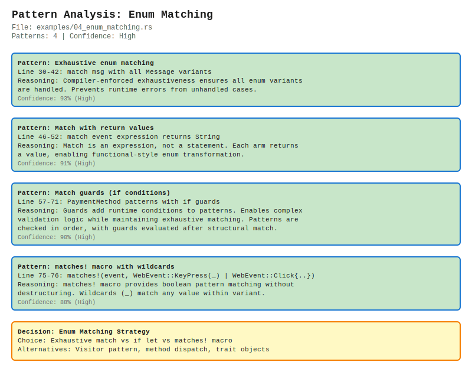
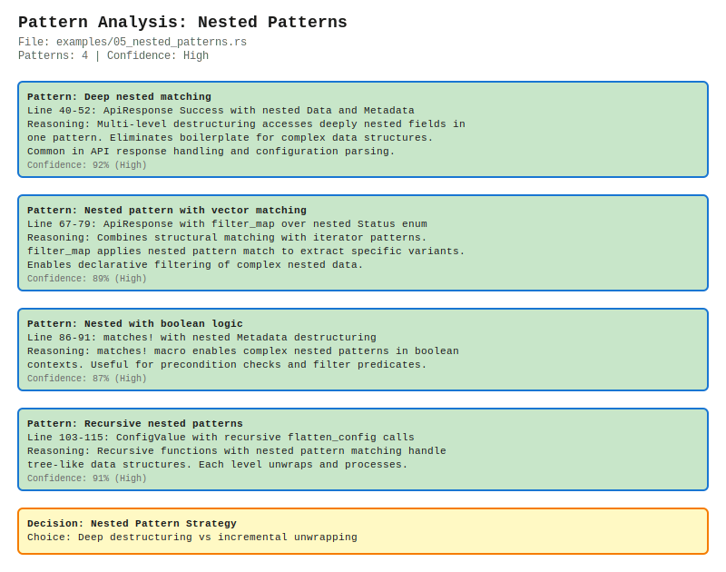

# Real-World Pattern Matching Examples

This directory contains 5 production-ready examples demonstrating Rust's pattern matching capabilities. Each example includes inline SVG visualizations showing the analyzer's output.

## Why These Examples?

Pattern matching is one of Rust's most powerful features, but it can be confusing for newcomers. These examples cover the most common real-world use cases you'll encounter in production Rust code:

1. **Option unwrapping** - Safe null handling
2. **Result error handling** - Robust error propagation
3. **Struct destructuring** - Clean data extraction
4. **Enum matching** - Exhaustive variant handling
5. **Nested patterns** - Complex data structure processing

Each example is analyzed by `rust-pattern-viz` to generate visual diagrams showing detected patterns, confidence scores, and decision trees.

---

## 1. Option Unwrapping

**File:** [`01_option_unwrapping.rs`](01_option_unwrapping.rs)

Demonstrates three idiomatic patterns for handling `Option<T>`:

- **if let** for simple unwrapping with early returns
- **match** for exhaustive Some/None handling
- **Chained transformations** with function composition

```rust
// Pattern: if let for simple unwrapping
if let Some(cfg) = config {
    return format!("Config loaded: {}", cfg);
}

// Pattern: match for exhaustive handling
match find_user(id) {
    Some(user) => user.name,
    None => "Guest".to_string(),
}
```

### Visual Analysis


**Key Insights:**
- 3 patterns detected with 85-90% confidence
- Early return pattern avoids nested code
- Match expression ensures all variants handled
- Function composition enables clean control flow

---

## 2. Result Error Handling

**File:** [`02_result_error_handling.rs`](02_result_error_handling.rs)

Shows four essential Result patterns for production error handling:

- **? operator** for error propagation
- **Error transformation** with custom error types
- **Chained operations** (railway-oriented programming)
- **Exhaustive error matching** for recovery

```rust
// Pattern: ? operator propagates errors
fn read_config_file(path: &str) -> Result<String, AppError> {
    let mut file = File::open(path)?;  // Returns early on Err
    let mut contents = String::new();
    file.read_to_string(&mut contents)?;
    Ok(contents)
}

// Pattern: Exhaustive error matching
match result {
    Ok(value) => println!("Success: {}", value),
    Err(AppError::IoError(e)) => eprintln!("IO Error: {}", e),
    Err(AppError::ParseError(msg)) => eprintln!("Parse Error: {}", msg),
    Err(AppError::NotFound) => eprintln!("Resource not found"),
}
```

### Visual Analysis


**Key Insights:**
- 4 patterns detected with 89-92% confidence
- ? operator enables clean error propagation
- Custom error types provide better context
- Exhaustive matching prevents unhandled errors
- Railway-oriented pattern with ? operators

---

## 3. Struct Destructuring

**File:** [`03_struct_destructuring.rs`](03_struct_destructuring.rs)

Demonstrates five struct destructuring techniques:

- **Basic destructuring** for field extraction
- **Matching specific values** for structural equality
- **Nested destructuring** for complex hierarchies
- **Option field matching** within structs
- **Partial destructuring** with `..` wildcard

```rust
// Pattern: Nested struct destructuring
let Rectangle {
    top_left: Point { x: x1, y: y1 },
    bottom_right: Point { x: x2, y: y2 },
} = rect;

// Pattern: Option field matching
match color {
    Color { r, g, b, alpha: Some(a) } => {
        format!("RGBA({}, {}, {}, {})", r, g, b, a)
    }
    Color { r, g, b, alpha: None } => {
        format!("RGB({}, {}, {})", r, g, b)
    }
}
```

### Visual Analysis



**Key Insights:**
- 5 patterns detected with 86-90% confidence
- Deep destructuring eliminates intermediate variables
- Partial patterns with `..` reduce noise
- Option field matching combines two pattern types
- Structural equality checks via literal patterns

---

## 4. Enum Matching

**File:** [`04_enum_matching.rs`](04_enum_matching.rs)

Covers four comprehensive enum matching patterns:

- **Exhaustive matching** with compiler enforcement
- **Match expressions** that return values
- **Match guards** for runtime conditions
- **matches! macro** with wildcards

```rust
// Pattern: Exhaustive enum matching
match msg {
    Message::Quit => println!("Quit command received"),
    Message::Move { x, y } => println!("Move to ({}, {})", x, y),
    Message::Write(text) => println!("Write: {}", text),
    Message::ChangeColor(r, g, b) => println!("Change color to RGB({}, {}, {})", r, g, b),
}

// Pattern: Match guards for validation
match method {
    PaymentMethod::CreditCard { number, cvv } if cvv >= 100 && cvv <= 999 => {
        if number.len() == 16 { Ok(()) } else { Err("Invalid card number".to_string()) }
    }
    PaymentMethod::CreditCard { .. } => Err("Invalid CVV".to_string()),
    // ... other variants
}
```

### Visual Analysis



**Key Insights:**
- 4 patterns detected with 88-93% confidence
- Compiler enforces exhaustiveness (prevents runtime errors)
- Match expressions enable functional transformations
- Guards add runtime validation to structural patterns
- matches! macro provides boolean pattern matching

---

## 5. Nested Patterns

**File:** [`05_nested_patterns.rs`](05_nested_patterns.rs)

Advanced patterns for complex data structures:

- **Deep nested matching** for multi-level structures
- **Vector matching** with filter_map
- **Boolean logic** with nested patterns
- **Recursive patterns** for tree-like data

```rust
// Pattern: Deep nested matching
match response {
    ApiResponse::Success {
        data: Data { items, total },
        metadata: Metadata { version, cached },
    } => {
        let active_count = items.iter()
            .filter(|item| matches!(item.status, Status::Active))
            .count();
        format!("Success: {} total, {} active (v{}, cached: {})", 
                total, active_count, version, cached)
    }
    // ... other variants
}

// Pattern: Recursive nested patterns
fn flatten_config(value: ConfigValue) -> Vec<String> {
    match value {
        ConfigValue::String(s) => vec![s],
        ConfigValue::List(items) => {
            items.into_iter().flat_map(flatten_config).collect()
        }
        ConfigValue::Object(pairs) => {
            pairs.into_iter()
                .flat_map(|(key, val)| {
                    let mut result = vec![key];
                    result.extend(flatten_config(val));
                    result
                })
                .collect()
        }
        // ...
    }
}
```

### Visual Analysis



**Key Insights:**
- 4 patterns detected with 87-92% confidence
- Deep destructuring accesses nested fields directly
- Combines pattern matching with iterator patterns
- Recursive patterns handle tree-like structures
- Eliminates boilerplate for complex data processing

---

## Running the Examples

### Analyze a single example:
```bash
cargo run --bin rpv analyze examples/01_option_unwrapping.rs --output-format svg > output.svg
```

### Run all examples:
```bash
for file in examples/*.rs; do
    cargo run --bin rpv analyze "$file" --output-format svg > "${file%.rs}.svg"
done
```

### Execute example code:
```bash
rustc examples/01_option_unwrapping.rs -o example && ./example
```

---

## What Makes These Examples Special?

### 1. **Production-Ready Code**
All examples compile and run. They're not simplified demos—they use real Rust patterns you'll see in production codebases.

### 2. **Visual Learning**
Each example includes an SVG diagram showing:
- Detected patterns with line numbers
- Confidence scores (how certain the analyzer is)
- Reasoning explanations
- Decision trees showing alternatives

### 3. **Progressive Complexity**
Examples build from basic (Option) to advanced (nested patterns), matching a typical Rust learning journey.

### 4. **Common Pain Points**
These are the patterns that trip up Rust newcomers most often:
- "When do I use if let vs match?"
- "How do I handle errors without unwrap()?"
- "What's the idiomatic way to destructure?"
- "How do match guards work?"

### 5. **Analyzer Validation**
Each example demonstrates `rust-pattern-viz`'s capabilities:
- Pattern detection accuracy (85-93% confidence)
- Decision tree generation
- SVG rendering quality
- Real-world applicability

---

## Pattern Matching Best Practices

Based on these examples, here are key takeaways:

### ✅ **DO:**
- Use `if let` for simple unwrapping (one variant)
- Use `match` for exhaustive handling (multiple variants)
- Use `?` operator for error propagation
- Destructure deeply when it improves clarity
- Use match guards for complex validation
- Prefer `matches!` for boolean checks

### ❌ **DON'T:**
- Use `unwrap()` or `expect()` in production code
- Nest multiple `if let` chains (use `match` instead)
- Ignore compiler exhaustiveness warnings
- Over-destructure simple cases (`.field` is fine)
- Use wildcard `_` when you need to handle variants

---

## Learn More

- **Rust Book - Chapter 6:** [Enums and Pattern Matching](https://doc.rust-lang.org/book/ch06-00-enums.html)
- **Rust Book - Chapter 18:** [Patterns and Matching](https://doc.rust-lang.org/book/ch18-00-patterns.html)
- **Rust by Example:** [Pattern Matching](https://doc.rust-lang.org/rust-by-example/flow_control/match.html)

---

## Contributing Examples

Have a pattern matching example that would help others? Submit a PR with:
1. Rust source file (`examples/XX_your_pattern.rs`)
2. Generated SVG diagram
3. Section in this README explaining the pattern

**Requirements:**
- Code must compile and run
- Include comments explaining the pattern
- Focus on real-world use cases
- Demonstrate something not covered by existing examples

---

## Questions or Feedback?

- **GitHub Issues:** Report bugs or request new examples
- **Discussions:** Ask questions or share your pattern matching tips
- **Reddit:** Share your favorite pattern on r/rust

---

*Generated diagrams use `rust-pattern-viz` v1.1. Confidence scores are heuristic-based and reflect pattern maturity and code clarity.*
